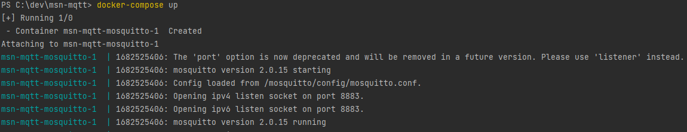

# MSN-MQTT

Ce projet a été réalisé dans le cadre des cours d'Internet des objets (IoT) pour implémenter un forum de discussion en temps réel (CHAT) similaire à MSN, en utilisant le protocole MQTT.

### Prérequis :
- Avoir Node.js et Docker installés et fonctionnels sur votre machine.
  J'utilise Docker desktop pour Windows : https://www.docker.com/products/docker-desktop/
- Développé pour fonctionner sur Windows. (Cela peut ne pas fonctionner sur d'autres systèmes d'exploitation)

## Comment utiliser

Pour utiliser ce projet, vous devez d'abord cloner ce projet.
```
git clone https://github.com/amaurydelassus/msn-mqtt.git
```
Puis dans un terminal situé dans le dossier cloné,
```
cd msn-mqtt
```
Lancez le serveur Mosquitto en utilisant Docker avec la commande suivante (ps : n'oubliez pas d'ouvrir l'application Docker et de croiser les doigts) :
```
docker-compose up
```



Si vous avez une erreur, cela peut être dû à l'utilisation du port 8883 ou votre connexion Internet.

Puis dans un autre terminal installez les dépendances avec la commande suivante :
```
npm install
```
Vous aurez besoin d'un utilisateur pour créer votre utilisateur utiliser la commande :
```
node .\app\adduser.js
```
Ou utiliser l'utilisateur de test (test/test) ou/et amaury (amaury/amaury):

Ensuite, vous pouvez lancer l'application avec la commande suivante :
```
node .\app\server.js
```
Entrez vos informations d'utilisateur/mot de passe et une fenêtre de discussion s'ouvrira.

Pour ouvrir dans la même fenêtre vous pouvez utiliser la commande :
```
node .\app\chat.js username password
```

Pour voir les logs du serveur : 
```
node .\app\allLog.js
```

## Fonctionnement du chat

Le projet comprend un backend (docker et fichier de config) et un frontend (app console) avec les fonctionnalités suivantes :

### chat public
- Pour envoyer un message public (Dans le topic public), il suffit de taper votre message et d'appuyer sur entrer.
- L'affichage sera comme ceci :
```
Général/<username> a dit : Votre message.
```
### Topic et Sous topic
- Pour envoyer un message dans un topic il faut utiliser le '#NonDeVotreTopic>' suivi de votre message(Un nom de topic et en un seul mot):

Exemple :
```
#MonTopic Votre message
```

- Pour envoyer un message dans un sous topic il faut utiliser le '/NonDuSousTopic' pour chaque sous-topic :

Exemple :
```
#MonTopic/SousTopic Votre message.
```
- Pour souscrire a un Topic ou sous topic utiliser les commandes si dessus sans le message (Si vous envoyer un message la souscription ce fait automatiquement)

- Pour inviter une personne dans un topic :

```
@Destinataire #MonTopic/SousTopic
```

### One to One

- Le one to one utilise le préfixe @NomDuDestinataire

Exemple :
```
@DestinataireDuMessage Votre message
```
### Quelle que commande !
- pour les commandes utiliser le "/"
```
/cmd : Clear la console
/users : Montre les users connecté au brocker mqtt
```
## TD

Ce projet a été développé dans le cadre d'un TP et utilise les outils suivants :

- J'ai choisi Mosquitto car il est un broker MQTT open source léger qui est facile à installer et à configurer (grace a des tuto en ligne).
- Il est idéal pour les projets de petite et moyenne taille avec une faible charge de trafic MQTT.


La solution sera notée sur 15 points avec la répartition suivante :

- 3 points pour l’explication sur le fonctionnement de votre solution
- 3 points pour le chat général
- 3 points pour le fonctionnement en one to one
- 4 points pour la gestion d’un canal de discussion (création, invitation, discussion, sortie)
- 2 points pour la qualité du code

### Backend

- Serveur mosquitto (Broker MQTT)
- Gestion des Usernames par mosquitto (User/Password : fichier password_file.txt)
- Gestion des canaux de discussion (topic)
- Gestion des One to One (topic privé)

### Frontend

- Application de chat.
- Gestion des utilisateurs -> connexion avec login mots de passe // deconextion des doublons.
- Chat public pour discuter.
- Possibilité de suivre, créer et quitter un canal (topic) de discussion avec un nom : grâce à #
- Possibilité de discuter en one to one avec un autre utilisateur grâce au @
- Inviter des utilisateurs dans un canal de discussion.

Il n’y a pas de mise en place de gestion de droits et de rétention (si on démarre l’application, les canaux sont vides, ainsi que les utilisateurs).

## Auteur

Ce projet a été réalisé par Amaury DELASSUS.

## Recherche et Source :

- https://www.youtube.com/watch?v=6ns4F-3N1Ms
